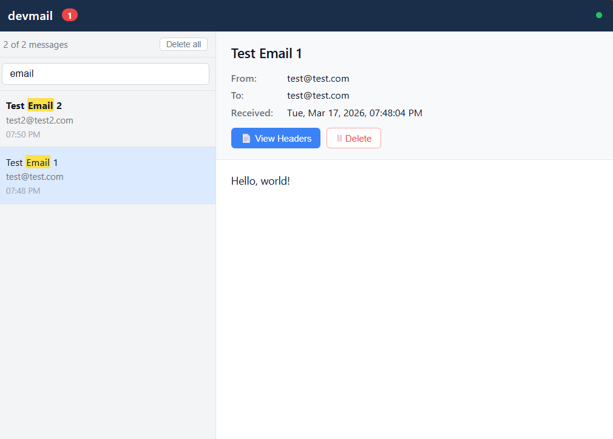

# devmail

A cross-platform local SMTP sink and webmail UI for development. Accepts all incoming email on port 1025 and displays it in a browser-based webmail interface on port 8085. No email is ever delivered — everything stays local.

**License:** MIT — Copyright (c) 2026 Matt Smith

---



---

## Features

- **SMTP sink** on `127.0.0.1:1025` — accepts any sender/recipient, no auth, no TLS; injects a `Received` trace header (RFC 5321 §4.4)
- **Webmail UI** at `http://127.0.0.1:8085` — no login required by default
- Search emails by subject, from, to, and CC — keywords highlighted in yellow
- Optional password protection via `--pass` or `DEVMAIL_PASS` env var
- Supports text, HTML, images, and attachments
- In-memory storage by default; optional mbox disk storage with reload on startup
- Cross-platform: Windows and Linux (x86_64)
- Single self-contained binary, no external files needed

---

## Usage

```
devmail [OPTIONS]

Options:
      --store              Enable disk storage (mbox format)
      --path <PATH>        Storage directory [default: system temp dir]
      --smtp-addr <ADDR>   SMTP listen address [default: 127.0.0.1:1025]
      --http-addr <ADDR>   HTTP listen address [default: 127.0.0.1:8085]
      --pass <PASSWORD>    Password to protect the webmail UI [env: DEVMAIL_PASS]
  -h, --help               Print help
  -V, --version            Print version
```

**Run with defaults (in-memory, no auth):**
```
devmail
```

**Run with disk storage (mbox saved to temp dir):**
```
devmail --store
```

**Run with disk storage at a specific path:**
```
devmail --store --path /home/user/mail
```

**Run with password-protected webmail:**
```
devmail --pass mysecret
```

Or via environment variable:
```
DEVMAIL_PASS=mysecret devmail
```

---

## Webmail Interface

Open `http://127.0.0.1:8085` in your browser after starting devmail.

- **Left pane**: list of received emails — bold when unread; count shown in toolbar
- **Search box**: filter by subject, from, to, or CC — matching words highlighted in yellow
- **Right pane**: full email view with headers, attachments, and body
- **View Headers** button: popup showing raw RFC 5322 headers only
- **Delete** / **Delete all**: remove individual emails or clear the inbox
- HTML emails render in a sandboxed iframe; attachments are downloadable
- If `--pass` is set, a login screen is shown before any content is accessible; a **Sign out** button appears in the header

---

## Sending Test Email

Using [swaks](http://www.jetmore.org/john/code/swaks/):
```
swaks --to test@example.com --from sender@example.com \
      --server 127.0.0.1 --port 1025 \
      --body "Hello from devmail"
```

Or with any SMTP client pointed at `127.0.0.1:1025` (no TLS, no auth).

---

## Building

### Windows (native)
```
cargo build --release
# Output: target\release\devmail.exe
```

Make release zip (requires Git Bash):
```
./build.sh release-windows
# Output: dist\devmail-v1.0.0-windows-x86_64.zip
#   devmail-v1.0.0-windows-x86_64\devmail.exe
#   devmail-v1.0.0-windows-x86_64\LICENSE.md
#   devmail-v1.0.0-windows-x86_64\README.md
```

### Linux (via Docker Desktop on Windows)
```
./build.sh build-linux
# Output: dist/devmail  (Linux x86_64 binary)

./build.sh release-linux
# Output: dist/devmail-v1.0.0-linux-x86_64.tar.gz
#   devmail-v1.0.0-linux-x86_64/devmail
#   devmail-v1.0.0-linux-x86_64/LICENSE.md
#   devmail-v1.0.0-linux-x86_64/README.md
```

---

## Testing with Docker

Build the Linux binary first, then run it in an Ubuntu 24.04 container:
```
./build.sh test-container
# Exposes SMTP on localhost:1025 and webmail on localhost:8085
```

---

## Disk Storage

When `--store` is used, emails are saved to `devmail.mbox` in the storage directory
using standard mbox format. On restart, devmail reloads all emails from the mbox
file — read/unread status is preserved in a `devmail_state.json` sidecar. Deleted
emails are removed from the mbox immediately (the file is rewritten on each delete).

The mbox file can also be opened directly in any mbox-compatible mail client
(Thunderbird, mutt, etc.).

---

## Dependencies

All dependencies are MIT or Apache 2.0 licensed — no copyleft.

| Crate | Version | License |
|-------|---------|---------|
| tokio | 1.37 | MIT |
| axum | 0.7 | MIT |
| tower-http | 0.5 | MIT |
| clap | 4.5 | MIT/Apache 2.0 |
| serde / serde_json | 1.0 | MIT/Apache 2.0 |
| mail-parser | 0.9 | Apache 2.0 |
| chrono | 0.4 | MIT/Apache 2.0 |
| uuid | 1.8 | MIT/Apache 2.0 |
| indexmap | 2.2 | MIT/Apache 2.0 |
| base64 | 0.22 | MIT/Apache 2.0 |
| anyhow | 1.0 | MIT/Apache 2.0 |
| tracing / tracing-subscriber | 0.1 / 0.3 | MIT |
